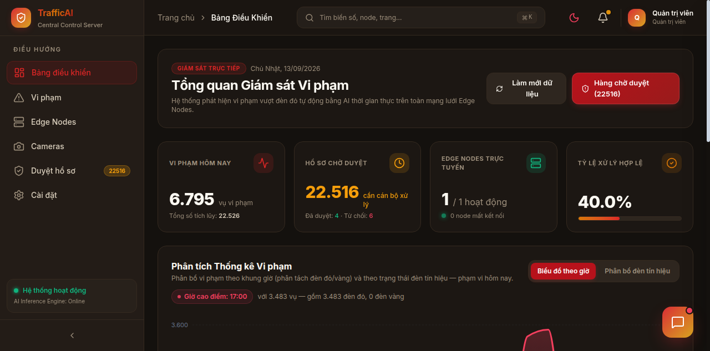
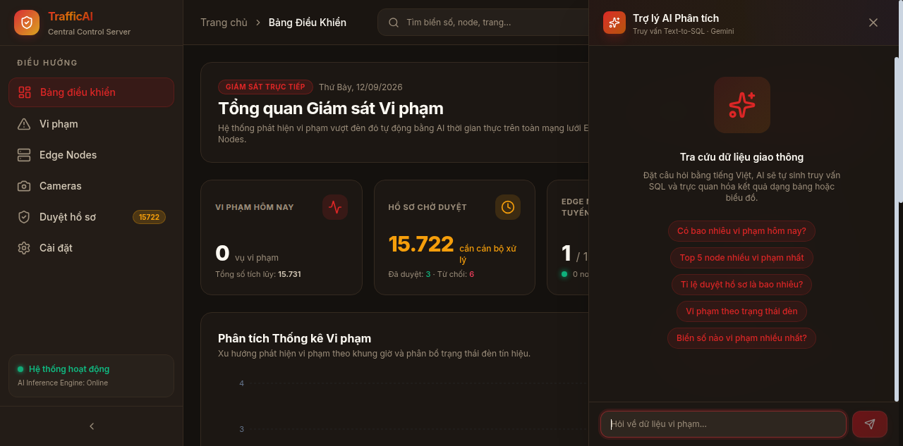
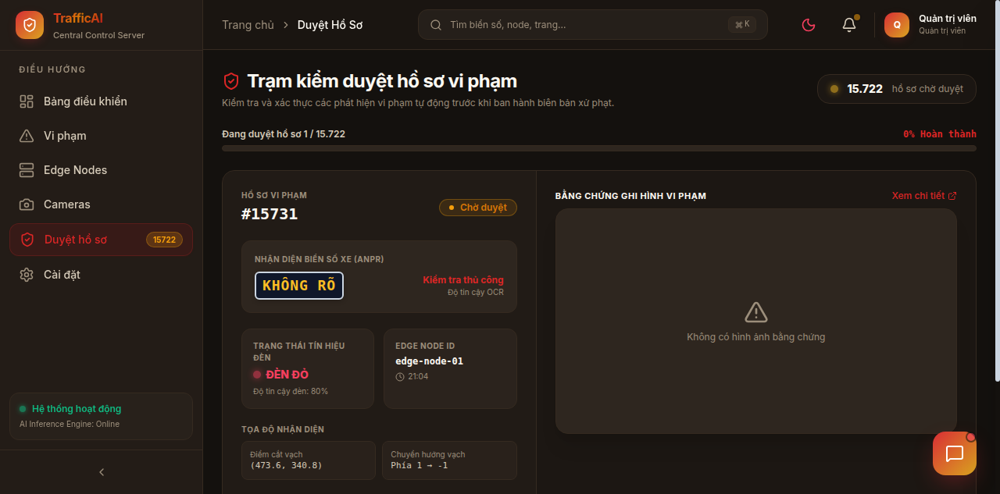
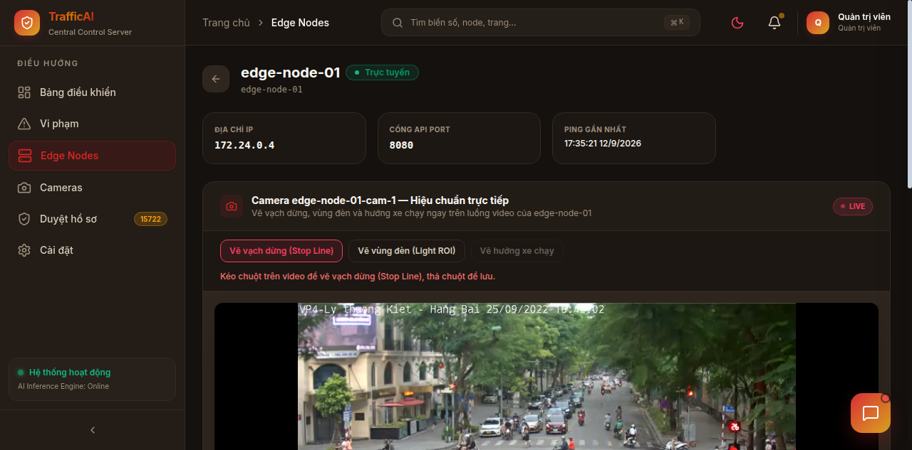
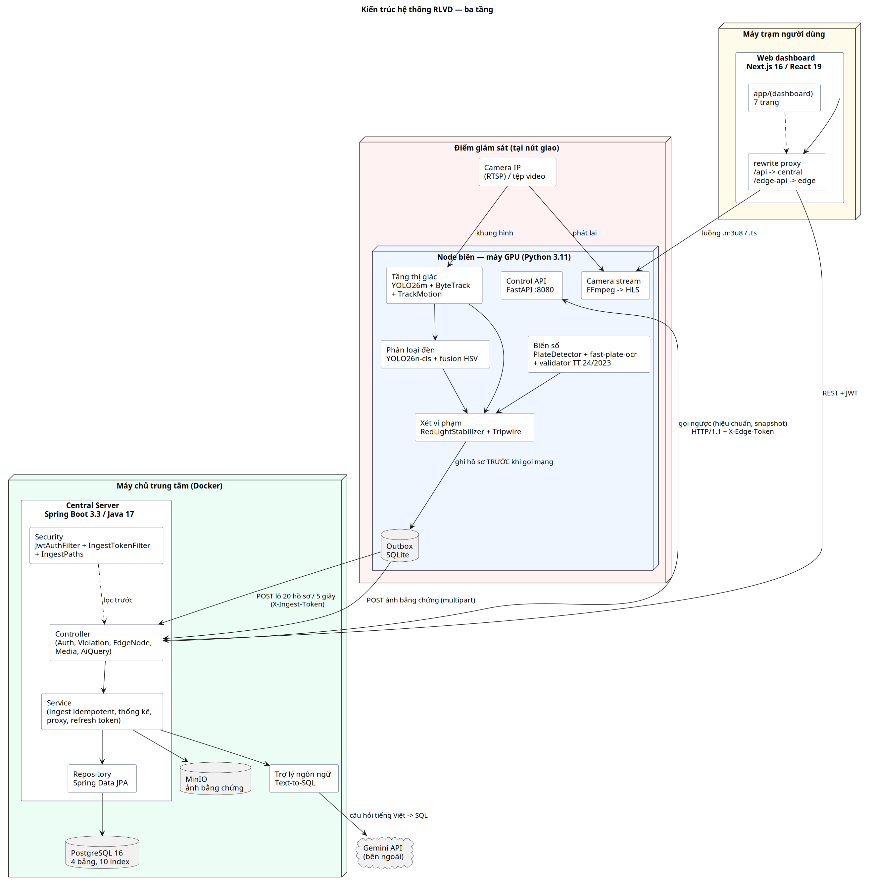
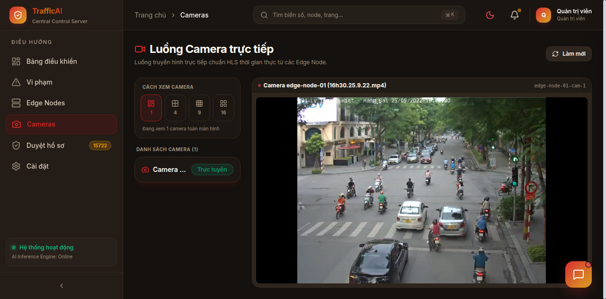
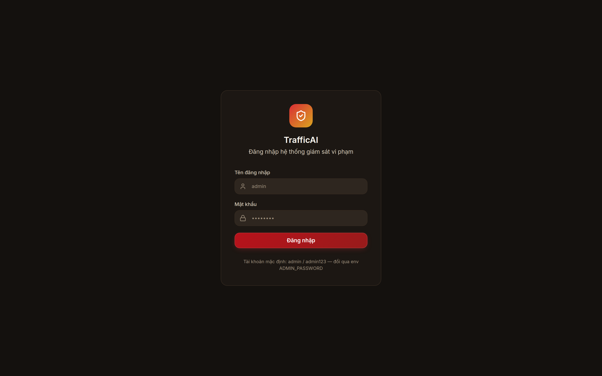

# RLVD — Red-Light Violation Detection

Hệ thống phát hiện vi phạm vượt đèn đỏ theo kiến trúc **Edge – Central – Web**:

- **Edge Node** (Python) đặt tại mỗi camera: xử lý video realtime, phát hiện xe vượt đèn đỏ, đọc biển số, đẩy hồ sơ vi phạm về trung tâm.
- **Central Server** (Java Spring Boot) nhận và lưu trữ vi phạm (PostgreSQL + MinIO), cung cấp REST API và AI hỏi dữ liệu bằng tiếng Việt.
- **Web Dashboard** (Next.js) giám sát, duyệt vi phạm, xem camera live, kẻ vạch dừng / vùng đèn / hướng giám sát từ xa.

## Ảnh chụp hệ thống

| Dashboard — tổng quan KPI + biểu đồ | AI Trợ lý phân tích |
|---|---|
|  |  |

| Duyệt hồ sơ vi phạm (human-in-the-loop) | Hiệu chuẩn vạch dừng trên luồng camera |
|---|---|
|  |  |

Kiến trúc ba tầng:



| Lưới camera live 1/4/9/16 | Đăng nhập + phân quyền RBAC |
|---|---|
|  |  |

Sơ đồ kiến trúc đầy đủ (18 hình PlantUML tiếng Việt): `docs/report-assets/thesis/` — kiến trúc, ERD, sequence auth/ingest/calibration/AI, state vi phạm, use case, security layers.

## Tài liệu

- [Báo cáo đồ án 102 trang (PDF — xem trực tiếp trên GitHub)](docs/RLVD_DoAn_2026.pdf)
- [Bản DOCX (chỉnh sửa)](docs/final-report.docx) — 7 chương, 22 hình, 18 bảng, dựng từ source code thực tế
- [Tài liệu API](docs/api/README.md) — toàn bộ 40+ endpoint 3 tầng
- [Hướng dẫn triển khai production](docs/deployment/production-guide.md) — env, Nginx/TLS, backup, restore, rollback
- [Báo cáo kiểm thử](docs/test-report.md) — 85/85 unit + build + security scan
- [Production readiness 78/100](docs/production-readiness.md) — checklist 22 mục + phân loại issue
- [Changelog audit 9/2026](docs/CHANGELOG.md)
- Diagram: `docs/diagrams/` (10 Mermaid — kiến trúc, sequence, ERD, use case, deployment) + `docs/report-assets/vn/` (21 PlantUML Việt hoá)

## Kiến trúc tổng quan

```
   Camera/Video
        │
        ▼
┌──────────────┐   violation batch + media    ┌──────────────────┐
│  EDGE NODE   │ ───────────────────────────▶ │  CENTRAL SERVER  │
│  Python      │   (durable SQLite outbox)    │  Spring Boot     │
│  YOLO+Byte   │                              │        │         │
│  Track+OCR   │ ◀── calibration (vạch/hướng) │   ┌────┴────┐    │
│  FastAPI     │        (proxy từ web)        │   ▼         ▼    │
│  HLS stream  │                              │ PostgreSQL  MinIO│
└──────────────┘                              └────────┬─────────┘
        ▲                                              │ /api (rewrite)
        │ xem live / kẻ vạch                           ▼
        └──────────────────────  WEB DASHBOARD (Next.js) ── AI Text-to-SQL (Gemini)
```

## Thư mục

```
.
├── edge_node/          # Node xử lý tại camera (Python) — xem edge_node/README.md
├── central_server/     # Backend trung tâm (Spring Boot) — xem central_server/README.md
├── web/                # Dashboard (Next.js) — xem web/README.md
├── train_model/        # Script huấn luyện YOLO (biển số, đèn, phương tiện)
├── scripts/            # Benchmark model + cài nvidia-container-toolkit
├── models/             # Weights YOLO (không commit — *.pt trong .gitignore)
├── data/               # Video, calibration, outbox, HLS (không commit)
├── run_pipeline.py     # Runner test pipeline local (calibration bằng chuột, không gửi server)
├── docker-compose.full.yml  # Full stack: postgres + minio + central + web + edge
└── start.sh            # Script dựng/chạy toàn bộ stack bằng Docker
```

## Yêu cầu

- **Docker** + Docker Compose plugin (chạy full stack)
- **GPU NVIDIA** + nvidia-container-toolkit (tăng tốc YOLO/OCR cho edge — khuyến nghị)
- Weights model trong `models/`: `yolo26m_vehicle.pt` (bắt buộc), `traffic_light_cls.pt`, `license_plate_yolo26.pt`
- Video đầu vào trong `data/videos/` (mặc định `data/videos/16h30.25.9.22.mp4`)

## Chạy nhanh (Docker full stack)

```bash
./start.sh              # build + chạy tất cả service
./start.sh --no-build   # bỏ qua build lại image
./start.sh minimal      # chỉ web + central + postgres + minio (không edge/GPU)
./start.sh status       # trạng thái container
./start.sh logs         # tail logs
./start.sh rebuild web-dashboard   # build lại 1 service
./start.sh down         # dừng + xoá container
```

Cổng mặc định (host):

| Service | Cổng | Ghi chú |
|---|---|---|
| web-dashboard | `3000` | Mở trình duyệt tại đây |
| central-server | `8002` | API nội bộ `:8000` |
| edge-pipeline | `8082` | Control-plane API nội bộ `:8080` |
| postgres | `5432` | DB `rlvd_central` |
| minio | `9010` (S3) / `9011` (console) | Bucket `violations` |

## Quy trình vận hành

1. **Edge node khởi động** → tự đăng ký + heartbeat lên Central (kèm `X-Ingest-Token`).
2. **Đăng nhập web** `http://localhost:3000` → `/login` (mặc định `admin/admin123` — đổi qua `ADMIN_PASSWORD`).
3. **Mở web** → trang Nodes → chọn node.
4. **Kẻ calibration** trên ảnh snapshot: vạch dừng (2 điểm), **mũi tên hướng giám sát** (đường 2 chiều — chỉ tính xe đi đúng hướng), vùng đèn (2 điểm). Lưu có hiệu lực ngay, không cần restart.
5. **Pipeline xét vi phạm**: xe cắt vạch dừng khi đèn đỏ đã ổn định → tạo hồ sơ (ảnh toàn cảnh + crop biển số + metadata) → đẩy lên Central qua outbox.
6. **Duyệt trên web**: trang Review để xác nhận / từ chối (human-in-the-loop); trang Violations để tra cứu; AI chat để hỏi bằng tiếng Việt.

Chưa kẻ vạch → pipeline vẫn chạy detection/tracking nhưng không xét vi phạm.

## Bảo mật (auth + phân quyền)

- **Web users** đăng nhập JWT (HS256, TTL 12h) — vai trò `ADMIN > OPERATOR > OFFICER`: Operator hiệu chuẩn node; Officer duyệt hồ sơ; Admin toàn quyền.
- **Edge node** dùng `X-Ingest-Token` khi đẩy hồ sơ lên Central (tách khỏi JWT user), `X-Edge-Token` cho endpoint ghi + rate limit 30 req/phút/IP + CORS whitelist.
- Secret đặt trong `.env` ở gốc repo — **file .env DUY NHẤT cho cả 3 compose** (full stack, `central_server/`, `edge_node/`; docker compose tự nạp theo project directory): `JWT_SECRET` (bắt buộc ≥ 32 ký tự), `ADMIN_PASSWORD`, `INGEST_TOKEN`, `EDGE_API_TOKEN`, `DB_PASS`, `MINIO_*` — xem mẫu `.env.sample` ở gốc.

## Test pipeline local (không cần Docker/server)

```bash
python run_pipeline.py                          # video mặc định
python run_pipeline.py data/videos/aziz1.MP4
python run_pipeline.py --recalibrate            # kẻ lại bằng chuột
```

Calibration bằng chuột trên frame đầu, lưu vào `data/calibration.json`. Live view: box xe vi phạm tô **đỏ**, overlay tự scale theo độ phân giải.

## Công nghệ chính

| Thành phần | Công nghệ |
|---|---|
| Phát hiện phương tiện | YOLO26m fine-tuned (car/bike/van-bus/truck), CUDA + FP16, hỗ trợ ONNX/TensorRT |
| Tracking | ByteTrack (supervision) |
| Đèn giao thông | YOLO26n-cls fine-tuned (LISA) + fusion HSV; fallback OpenCV HSV |
| OCR biển số | fast-plate-ocr (ONNX) + validator chuẩn biển VN |
| Delivery | Durable SQLite outbox + batch sender (chịu mất mạng/restart) |
| Backend | Spring Boot 3.3.2 / Java 17, JPA, MinIO SDK |
| AI query | Gemini Text-to-SQL (chỉ SELECT, chặn SQL nguy hiểm) |
| Frontend | Next.js 16 / React 19 / Tailwind 4 / recharts / hls.js |
| Hạ tầng | PostgreSQL 16, MinIO, Docker Compose |

## Huấn luyện model

Script trong `train_model/`:

- `vehical_detection/` — detect phương tiện (ra `models/yolo26m_vehicle.pt`)
- `lincenseplate/` — detect biển số (ra `models/license_plate_yolo26.pt`)
- `traffic_light_cls/` — phân loại màu đèn (ra `models/traffic_light_cls.pt`)

Benchmark model: `scripts/benchmark_vehicle_models.py`.

## Troubleshooting

| Triệu chứng | Nguyên nhân thường gặp | Cách xử lý |
|---|---|---|
| Vi phạm không về trung tâm | Central down / sai INGEST_TOKEN | `docker logs <edge> \| grep Batch` — pending tích luỹ sẽ tự flush; kiểm tra token trùng 2 phía |
| Ảnh bằng chứng NULL | Endpoint media thiếu trong IngestPaths (đã tập trung — không sửa SecurityConfig tay) | Kiểm tra `SELECT COUNT(*) WHERE status='sent' AND media_sent=0` trong outbox |
| Video stream cũ sau rebuild | Compose bake `--input` lúc build | Đổi VIDEO_INPUT trong compose + rebuild edge; verify `docker inspect .Config.Cmd` |
| Web 500 lúc khởi động | Central chưa boot xong | Healthcheck + depends_on đã xử lý; chờ thêm 30s |
| `/health` edge trả 503 | Pipeline stale >10s hoặc không có camera thật | Video-file mode 503 degraded là bình thường |
| Đèn chuyển chậm | Ngưỡng theo FPS nguồn | `RED_LOCK/SWITCH/UNKNOWN_TOLERANCE_SECONDS` (mặc định 0,4/0,8/0,8s) |
| Box xe kép trên live view | 2 lớp det + track cùng hiển thị | Đã xử lý: chỉ vẽ det box khi IoU ≤ 0,30 so với track |
| OCR biển sai ký tự | O/0, I/1 nhầm lẫn | Bộ repair vùng-aware trong `vn_plate.py` tự sửa hoặc trả None |
| Node không hiện trên web | Server component thiếu cookie JWT | Mọi server component fetch central phải đọc cookie `rlvd_token` |

Chi tiết từng chẩn đoán: `docs/deployment/production-guide.md` §5-6 và skill references trong `.agents/skills/`.

## Tài liệu chi tiết

- [Edge Node](edge_node/README.md)
- [Central Server](central_server/README.md)
- [Web Dashboard](web/README.md)
